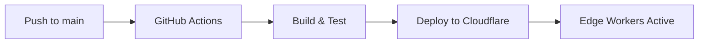

# Personal Portfolio Website - Project Overview

## 🎯 Project Purpose

This is a high-performance personal portfolio website for **Damian Meroni**, a Senior Software Engineer with 9+ years of experience specializing in scalable architectures and cloud-native applications. The website serves as a professional showcase and business contact point.

## 🏗️ Architecture Overview

### Technology Stack

| Category | Technology | Version | Purpose |
|----------|------------|---------|---------|
| **Framework** | Astro | 5.12.2 | Static site generation with optimal performance |
| **Language** | TypeScript | 5.8.3 | Type safety with strict mode enabled |
| **Styling** | Tailwind CSS | 4.1.11 | Utility-first CSS framework (v4 alpha) |
| **Image Processing** | Sharp | 0.34.3 | High-performance image optimization |
| **Build Tool** | Vite | via Astro | Fast bundling and HMR |
| **Package Manager** | pnpm | - | Efficient dependency management |
| **Deployment** | Cloudflare Pages | - | Global edge deployment |
| **Edge Functions** | Cloudflare Workers | - | Intelligent routing and i18n |

### Project Structure

```
personal-website/
├── src/
│   ├── assets/          # Static assets (tech logos, images)
│   ├── components/      # Atomic design pattern components
│   │   ├── background/  # Visual effects components
│   │   ├── cards/       # Reusable card components
│   │   ├── common/      # Base UI components (Button, Badge)
│   │   ├── icons/       # Icon components
│   │   ├── layout/      # Page structure (Header, Footer)
│   │   ├── sections/    # Page sections (Hero, About, etc.)
│   │   ├── seo/         # SEO-related components
│   │   └── ui/          # UI utilities
│   ├── data/            # Static data (projects, experience)
│   ├── layouts/         # Page layouts
│   ├── pages/           # Route-based pages
│   ├── styles/          # Global styles and themes
│   ├── types/           # TypeScript type definitions
│   └── utils/           # Helper functions
├── public/              # Static assets (fonts, locales)
├── functions/           # Cloudflare Workers edge functions
└── lighthouse/          # Performance test results
```

## 🚀 Key Features

### 1. Performance Optimization
- **Static Generation**: Pre-rendered HTML for instant loading
- **Image Optimization**: Automatic WebP conversion with Sharp
- **Asset Compression**: Brotli/Gzip compression for all assets
- **Cache Busting**: Content-hashed filenames
- **Lazy Loading**: Intersection Observer for animations
- **Core Web Vitals**: LCP < 2.5s, FID < 100ms, CLS < 0.1

### 2. Internationalization (i18n)
- **Multi-language Support**: Spanish and English
- **Geolocation Routing**: Automatic language detection
- **Edge Function Logic**: 
  - Spanish-speaking countries → Spanish version
  - Other countries → English version
- **Manual Override**: Language switcher available

### 3. Design System
- **Theme Support**: Dark/Light mode with system preference
- **Color Palette**: Purple/Pink gradients with glass morphism
- **Typography**: Manrope font family
- **Animations**: Smooth scroll-triggered animations
- **Responsive**: Mobile-first design (320px to 1920px)

### 4. Developer Experience
- **TypeScript**: Strict mode with comprehensive types
- **Path Aliases**: Clean imports (@components, @layouts)
- **Linting**: ESLint 9 with TypeScript support
- **Formatting**: Prettier with Astro plugin
- **Git Hooks**: Husky + lint-staged for quality control
- **Hot Reload**: Fast development with Vite

## 📋 Development Workflow

### Commands

```bash
# Development
npm run dev          # Start dev server on port 3000
npm run build        # Type check + production build
npm run preview      # Preview production build

# Code Quality
npm run lint         # Run ESLint
npm run format       # Format with Prettier
npm run update       # Update all dependencies

# Performance
npm run perf         # Generate Lighthouse report
```

### Build Process

1. **Type Checking**: TypeScript validation
2. **Static Generation**: Astro builds all pages
3. **Image Processing**: Sharp optimizes images
4. **Asset Optimization**: 
   - CSS/JS minification
   - HTML compression
   - SVG optimization
5. **Output Structure**: Organized dist/assets/

### Deployment Pipeline



## 🎨 Component Architecture

### Core Components

1. **Layout Components**
   - `BaseLayout`: Main page structure with SEO
   - `Header`: Navigation with theme toggle
   - `Footer`: Social links and copyright

2. **Section Components**
   - `Hero`: Dynamic text animation, CTA buttons
   - `About`: Professional summary
   - `Experience`: Timeline with expandable details
   - `Projects`: Card grid with tech stacks
   - `Contact`: Multiple contact methods

3. **UI Components**
   - `Button`: Variants (primary, secondary, outline)
   - `Card`: Flexible content container
   - `Badge`: Tech stack tags
   - `TechLogo`: Animated tech icons

### Data Structure

```typescript
// Experience Item
interface Experience {
  title: string;
  company: string;
  period: string;
  description: string;
  highlights: string[];
  tags: string[];
}

// Project Item
interface Project {
  title: string;
  description: string;
  image: string;
  technologies: string[];
  github?: string;
  live?: string;
}
```

## 🌐 Edge Function Architecture

### Middleware Logic (_middleware.ts)

```
Request → Cloudflare Worker → Geolocation Check
                ↓
    Spanish-speaking country?
         ↙         ↘
      Yes           No
        ↓            ↓
  /es redirect    Continue
```

### Spanish-Speaking Countries
- Spain, Mexico, Argentina, Colombia, Peru, Venezuela
- Chile, Ecuador, Guatemala, Bolivia, Cuba, etc.

## 📊 Performance Standards

### Metrics
- **Lighthouse Score**: 95+ across all categories
- **Bundle Size**: < 200KB JavaScript (gzipped)
- **First Paint**: < 1.5s on 3G
- **Time to Interactive**: < 3.5s on 3G

### Optimization Techniques
1. **Static Rendering**: No client-side hydration
2. **Critical CSS**: Inlined for faster rendering
3. **Font Loading**: font-display: swap
4. **Image Formats**: WebP with fallbacks
5. **Preloading**: Critical resources

## 🔒 Security & Compliance

### Security Headers
- Content Security Policy (CSP)
- X-Frame-Options
- X-Content-Type-Options
- Referrer-Policy

### Accessibility
- WCAG 2.1 AA compliance
- Semantic HTML structure
- ARIA labels where needed
- Keyboard navigation
- Screen reader tested

## 🚧 Project Standards

### Code Style
- **Components**: PascalCase (HeroSection.astro)
- **Files**: kebab-case (use-theme.ts)
- **Variables**: camelCase (firstName)
- **Constants**: SCREAMING_SNAKE_CASE (MAX_WIDTH)

### Git Workflow
- **Branches**: feature/*, fix/*, chore/*
- **Commits**: Conventional commits (feat:, fix:, etc.)
- **PRs**: Descriptive with test checklist

### Quality Checklist
- [ ] TypeScript: No errors
- [ ] Linting: All rules pass
- [ ] Formatting: Prettier applied
- [ ] Build: Production build succeeds
- [ ] Performance: Lighthouse 95+
- [ ] Accessibility: No violations

## 📈 Future Enhancements

### Planned Features
1. **Blog Section**: Technical articles and tutorials
2. **Analytics**: Privacy-focused visitor insights
3. **Progressive Web App**: Offline capabilities
4. **Advanced Animations**: Scroll-triggered effects
5. **CMS Integration**: Dynamic content management

### Technical Improvements
1. **View Transitions**: Astro's view transitions API
2. **Island Architecture**: Selective hydration
3. **Web Components**: Custom elements
4. **Service Worker**: Advanced caching
5. **WebAssembly**: Performance-critical features

## 🤝 Contributing

### Development Setup

```bash
# Clone repository
git clone [repo-url]
cd personal-website

# Install dependencies
pnpm install

# Start development
pnpm dev

# Run tests
pnpm test
```

### Code Review Criteria
1. **Performance Impact**: No regression
2. **Type Safety**: Full TypeScript coverage
3. **Accessibility**: WCAG compliance
4. **Browser Support**: Last 2 versions
5. **Mobile Experience**: Responsive design

---

## 📞 Contact

For questions or contributions, please reach out through:
- GitHub Issues
- Email: damianmarconeroni@gmail.com
- LinkedIn: Damian Meroni

---

*Last Updated: July 2025*